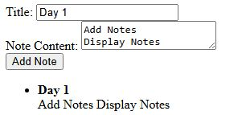

# NoteFlow

A JavaScript-based note management application that allows users to create, edit, delete, search, and organize notes. The project demonstrates DOM manipulation, event handling, local storage persistence, JSON handling, and dynamic UI updates using vanilla JavaScript.

## Technologies Used

- HTML5
- CSS3
- JavaScript (ES6+)
- localStorage

## Skills Demonstrated

- DOM Manipulation
- Event Handling
- JavaScript Objects & Arrays
- Array.filter()
- JSON.parse() / JSON.stringify()
- localStorage Persistence
- Dynamic UI Rendering
- Search Functionality
- CRUD Operations

## Features

- Create notes
- Edit notes
- Delete notes
- Search notes
- Store notes in localStorage
- Auto-tag notes based on keywords

## Future Improvements

- Dark Mode
- Categories and Tags
- Export Notes
- Backend Database Integration
- User Authentication

## Preview



## Installation

### Clone the Repository

```bash
git clone https://github.com/JothamDevWork/NoteFlow.git
```

### Navigate to the Project Folder

```bash
cd NoteFlow
```

### Open the Project

Since NoteFlow is built with vanilla HTML, CSS, and JavaScript, no additional dependencies are required.

Open `index.html` in your browser:

```bash
start index.html
```

Or simply double-click the `index.html` file.

## Usage

1. Enter a note title.
2. Enter the note content.
3. Click **Add Note**.
4. Search, edit, and delete notes.
5. Notes are automatically saved using localStorage and remain available after refreshing the page.

## Project Structure

```text
NoteFlow/
│
├── assets/
│   └── screenshot/
│       └── Day1.jpg
├── css/
├── js/
├── index.html
└── README.md
```

## Author

Jotham DevWork
